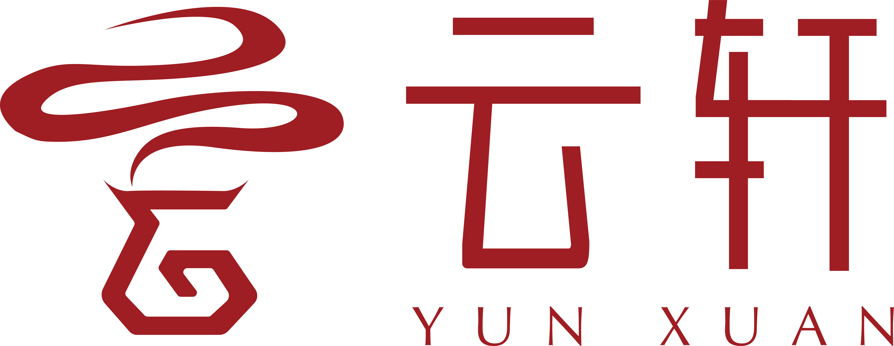

# 云轩技术开发团队 <!-- {docsify-ignore} -->
 

云轩开发团队于2020年2月由数名中山大学学生组建，是一个集前端、后端及服务端基础研究和产品开发的团队。

团队擅长并着力于设计和开发大型web系统，涵盖各类小程序，网页等基于web的应用程序。团队涉及技术栈涵括：`vue`，`flask`，`gin`，`grpc`，`mysql`，`redis`等，使用的语言包含`javascript`, `python`, `go`等。团队成员毕业后多就职于互联网大厂或名校深造，欢迎对前后台研发技术感兴趣的同学参与交流。

[Github主页](https://github.com/Yunxuan-Develop)  
opensource@yunxuancyj.cn

团队当前已直接或间接参与的开发项目：
1. **云轩电商微信小程序**  
2. **云轩电商后台管理系统**

团队当前已参与或自研的开源技术项目：

- [brandnew-flask](https://github.com/ysyisyourbrother/brandnew-flask) 脚手架工具

历史团队成员：
- [@brandonye](https://github.com/ysyisyourbrother)
- [@konzem](https://github.com/KONZEM)
- [@vayneyan](https://github.com/VayneYan)
- [@galaxyzzang](https://github.com/galaxyzzang)
- [@baiyue](https://github.com/baiyue990121)
